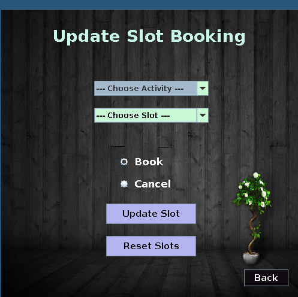

# Gymkhana Sports Management System

This project was undertaken by [Kousshik Raj](https://www.github.com/TheLethalCode) and [Snehal Reddy](https://www.github.com/Snehal-Reddy) under the guidance of Prof. Sudip Mishra for the course Software Engineering Laboratory (CS29006).

## Objective

The Gymkhana Sports Management System was taken up to address the various problems encountered while students and professors try to book slots for their favourite activity under **Gymkhana, IIT Kharagpur** such as long waiting time, complicated payment process, etc.

## Project

The Gymkhana Sports Management System is completely implemented in the JAVA programming language and uses SQLite for database management. It provides an extremely interactive and user-friendly GUI for the various users of the system. It is also extremely flexible and can easily extend its scope beyond its intended purpose. The simplicity of the implementation makes it extremely fast and robust, while taking care not to lose its sophistication in the process. It also focuses on providing an exhaustive list of features that makes the booking and cancelling processes of the various activities very smooth.

## Features

- Provides two levels of provileges - Admin and Normal User. 
    
    

- The Admin corresponds to a Gymkhana Authority who has administrative access and has the power to add new users, delete existing users and modify slots into the database.

    

- Adding new user is just what it means. The admin will be able to add new users to the system so that they will also be able to login and book their slots for the various activities.

    

- Deleting user feature is used by the authorities when they want to remove certain users from the system. The reason can vary from graduating/ resigning or due to some unsatisfactory behaviour.

    

- The modifying slot feature provides the admin with the capacity to update the slot statuses for various activities when the booking or cancelling has been done offline or resetting the slots at the end of the semester.

    

- The User can correspond to professors, students or any of the non-teaching staff of the campus who want to book their slots for the various activites. They are added to the system by the Gymkhana Authorities. They can check the vacancies for the various sports and activities they are interested in.

    

- For a particular sport, the vacanicies in all the slots are displayed. If there is a vacancy, then the user can book for that particular slot.
    - Slot 1: 5:30 am - 6:30 am
    - Slot 2: 6:30 am - 7:30 am
    - Slot 3: 5:00 pm - 6:00 pm
    - Slot 4: 6:00 pm - 7:00 pm
    - Slot 5: 7:00 pm - 8:00 pm

    

- During booking, the user is redirected to a portal. If the payment is successful, then that user is booked under that slot. This is just a frontend, and the actual payment process is yet to be realised.

    

## Scope

The Gymkhana SPorts Management System can be deployed as an desktop application for all the users in the campus, and the database can be accessed using the local network. The actual logistics are yet to be taken care of, after which, the app can be released to all the residents of IIT Kharagpur.

## Further Extension

This is just a very basic framework that was implemented in around 1 week. This has huge scope for further expansions. The design is such that, further integration with other features can be done easily. A lot of other facilities, such as sending confirmation emails, limiting user booking, enhancing security, making it more interactive, etc. can be accommodated into the application.